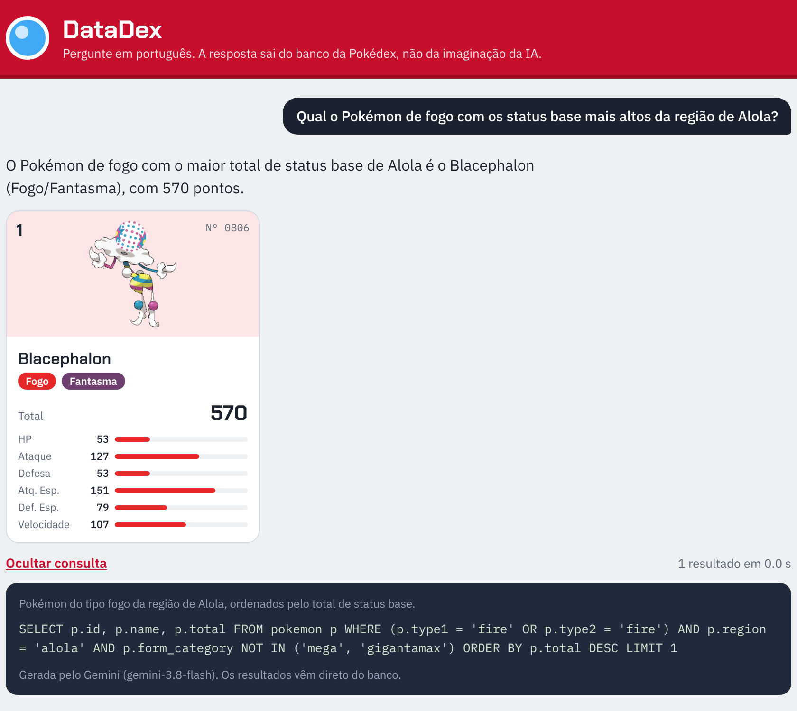

# DataDex — Pokédex com IA que não inventa respostas

Evolução do [DataChatbot](https://github.com/dheik/DataChatbot): em vez de gerar código pandas no terminal,
o DataDex é um produto web/mobile em que você pergunta sobre Pokémon em português e o
**Gemini traduz a pergunta em SQL**. A API executa essa consulta, com segurança, em um banco montado com os
dados oficiais da **PokéAPI**, e o app mostra exatamente os Pokémon que o banco devolveu.

> Exemplo: *"Qual o Pokémon de fogo com os status base mais altos da região de Alola?"*
> → o Gemini gera `SELECT ... WHERE (type1='fire' OR type2='fire') AND region='alola' ORDER BY total DESC LIMIT 1`
> → o banco devolve **Blacephalon (Fogo/Fantasma, total 570)** → o app mostra o card.

Como a resposta vem do banco, a IA não tem como "alucinar" um Pokémon ou um status: no máximo ela escreve
uma consulta errada, e essa consulta fica visível no app para conferência.



## Arquitetura

```
┌──────────────────────┐  POST /api/ask   ┌─────────────────────────┐   prompt + esquema   ┌──────────────┐
│ App React Native     │ ───────────────▶ │ API DataDex (FastAPI)   │ ───────────────────▶ │ API Gemini   │
│ (Expo: web/Android/  │ ◀─────────────── │ validações, regras,     │ ◀─────────────────── │ SQL em JSON  │
│  iOS)                │   JSON + cards   │ execução segura do SQL  │                      └──────────────┘
└──────────────────────┘                  │                         │   SELECT (somente leitura)
                                          │                         │ ───────────────────▶ ┌──────────────┐
                                          └─────────────────────────┘                      │ SQLite       │
                                                                                           │ (PokéAPI)    │
                                                                                           └──────────────┘
```

Fluxo de uma pergunta (`backend/app/services.py`):

1. **Valida a pergunta** (3 a 300 caracteres, precisa ter texto).
2. **Gemini gera o SQL** a partir do esquema real do banco, com saída JSON `{answerable, sql, explanation}` e temperatura 0.
3. **Valida e executa** o SQL: uma única instrução `SELECT`, conexão somente leitura, *authorizer* do SQLite liberando
   apenas as tabelas `pokemon` e `pokemon_abilities`, tempo limite de 2 s e no máximo 50 linhas.
4. Se o SQL der erro de execução, o **Gemini corrige uma vez**. SQL bloqueado por segurança nunca é reenviado.
5. Se a consulta trouxe a coluna `id`, a API monta os **cards** completos (tipos, status, habilidades, sprite);
   senão devolve uma **tabela** (contagens, médias).
6. O **Gemini escreve um resumo** de 1 a 3 frases usando só as linhas retornadas.

Outras regras: perguntas fora do tema retornam `422 not_answerable`; Mega e Gigantamax ficam de fora a não ser que
o usuário peça; perguntas repetidas voltam do cache; perguntas de continuação ("e os de água?") usam as 3 últimas
perguntas da sessão; limite de 20 perguntas por minuto por IP; todos os erros seguem o formato
`{"error": {"code", "message"}}`.

## Estrutura

```
pokedex-ai/
├── backend/
│   ├── app/
│   │   ├── main.py        # rotas FastAPI, tratamento de erros, rate limit
│   │   ├── services.py    # regras de negócio (fluxo da pergunta)
│   │   ├── database.py    # execução segura do SQL gerado pela IA
│   │   ├── llm.py         # integração com o Gemini (google-genai)
│   │   ├── prompts.py     # prompts (evolução do prompt_template.py original)
│   │   └── config.py      # configurações via .env
│   ├── data/pokemon.db    # banco pronto (1.323 Pokémon e formas)
│   ├── build_db.py        # recria o banco a partir dos CSVs da PokéAPI
│   ├── tests/test_api.py  # 17 testes com um Gemini falso
│   └── requirements.txt
├── frontend/              # app React Native (Expo)
│   ├── App.tsx
│   └── src/ (api.ts, theme.ts, components/)
└── docs/
    ├── DataDex_Apresentacao.pptx
    └── screenshots/
```

## Como rodar

### 1. Backend (Python 3.10+)

```bash
cd backend
python -m venv .venv
# Windows: .venv\Scripts\activate    |    macOS/Linux: source .venv/bin/activate
pip install -r requirements.txt
cp .env.example .env        # e coloque sua GEMINI_API_KEY
uvicorn app.main:app --reload --port 8000
```

A documentação interativa fica em http://localhost:8000/docs.
O banco `data/pokemon.db` já vem pronto. Para recriá-lo com os dados mais recentes da PokéAPI: `python build_db.py --refresh`.

Testes (não usam internet nem gastam cota do Gemini): `python -m pytest -q`

### 2. Frontend (Node 18+)

```bash
cd frontend
npm install
npx expo start --web        # abre no navegador
# ou: npx expo start  e escaneie o QR code com o app Expo Go no celular
```

Por padrão o app chama `http://localhost:8000` (no emulador Android, `http://10.0.2.2:8000`).
Para usar no celular físico, aponte para o IP do seu computador:

```bash
EXPO_PUBLIC_API_URL=http://192.168.0.10:8000 npx expo start
```

## Endpoints

| Método | Rota | Descrição |
|---|---|---|
| POST | `/api/ask` | `{ "question": "...", "session_id": "..." }` → resposta, SQL, cards ou tabela |
| GET | `/api/pokemon/{id}` | Ficha completa de um Pokémon |
| GET | `/api/examples` | Perguntas de exemplo |
| GET | `/api/history` | Últimas 50 perguntas feitas |
| GET | `/api/health` | Status da API e do banco |

## Configuração (`backend/.env`)

| Variável | Padrão | Descrição |
|---|---|---|
| `GEMINI_API_KEY` | — | Chave do Google AI Studio |
| `GEMINI_MODELS` | `gemini-3.8-flash,gemini-2.5-flash` | Modelo principal e reservas, em ordem |
| `MAX_QUESTION_LENGTH` | 300 | Tamanho máximo da pergunta |
| `MAX_ROWS` | 50 | Máximo de linhas por resposta |
| `RATE_LIMIT_PER_MINUTE` | 20 | Perguntas por minuto por IP |
| `CORS_ORIGINS` | `*` | Origens liberadas para o app web |

## Dados

Os dados vêm da [PokéAPI](https://pokeapi.co), via os CSVs publicados em
[github.com/PokeAPI/pokeapi](https://github.com/PokeAPI/pokeapi/tree/master/data/v2/csv). Pokémon e nomes são marcas
da Nintendo/Game Freak/The Pokémon Company; este é um projeto acadêmico sem fins comerciais.
